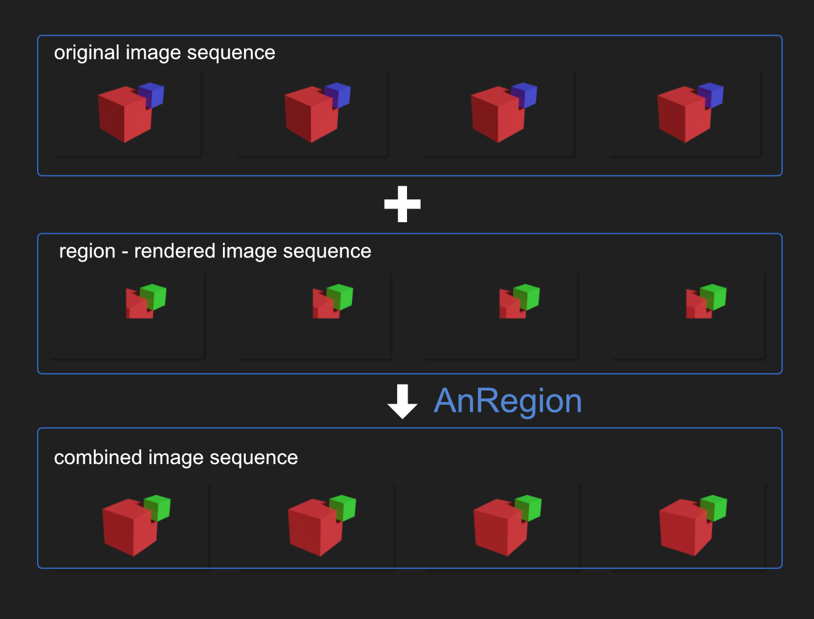
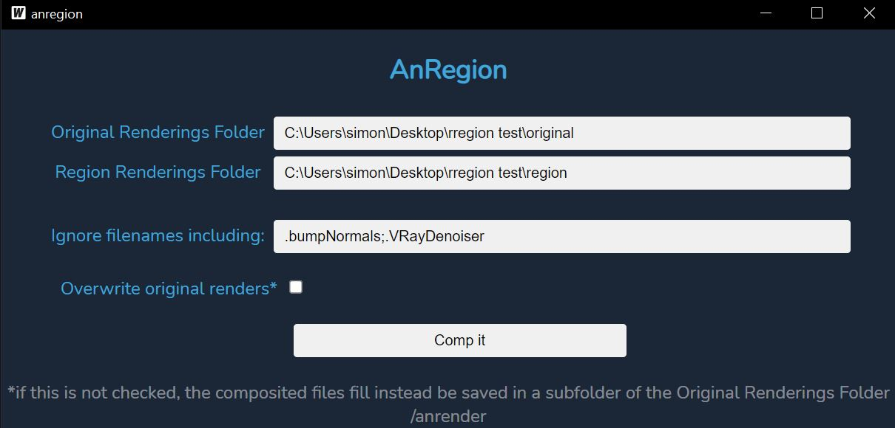

# AnRegion

If you ever want to re-render just a region of an animation and want a simple tool to combine the new region-rendered image sequence with the original one, look no further!

## How To

- Download the [latest released zip file](https://github.com/SimonStorlSchulke/AnRegion/releases/latest), unpack it and run anregion.exe
- Fill in the filepaths to the original and the region-rendered image sequence folders
- If you want, you can let AnRegion ignore all filenames containing the words specified in the third input-field (separate words with a single ; and NO space)
- If you want AnRegion to overwrite the original files, check the checkbox. Else, the composited files will be saved in a subfolder of the Original Renderings Folder */anrender*

## Credits

This Tool is written in Go and Svelte, using [Wails](https://wails.io) and [ImageMagick](https://imagemagick.org). See the ImageMagick license at https://imagemagick.org/script/license.php
